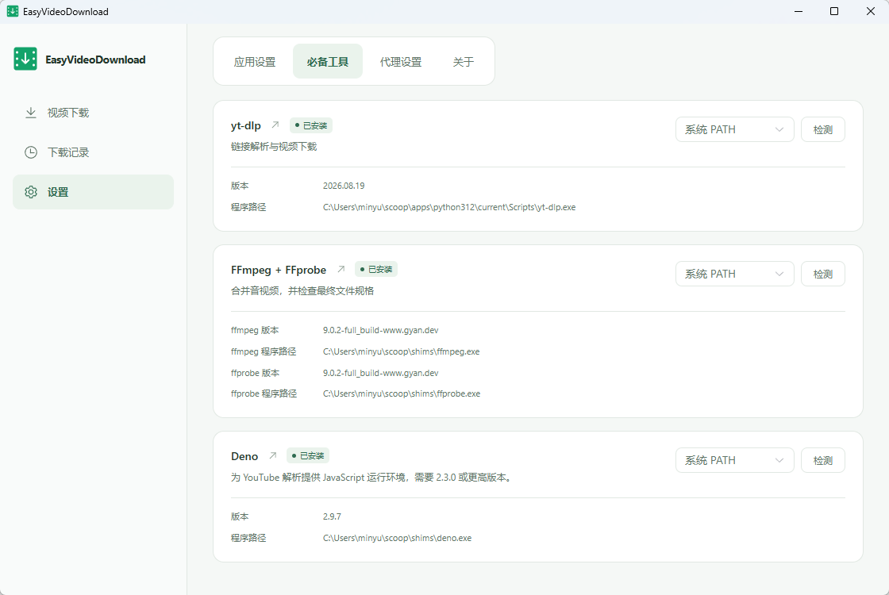
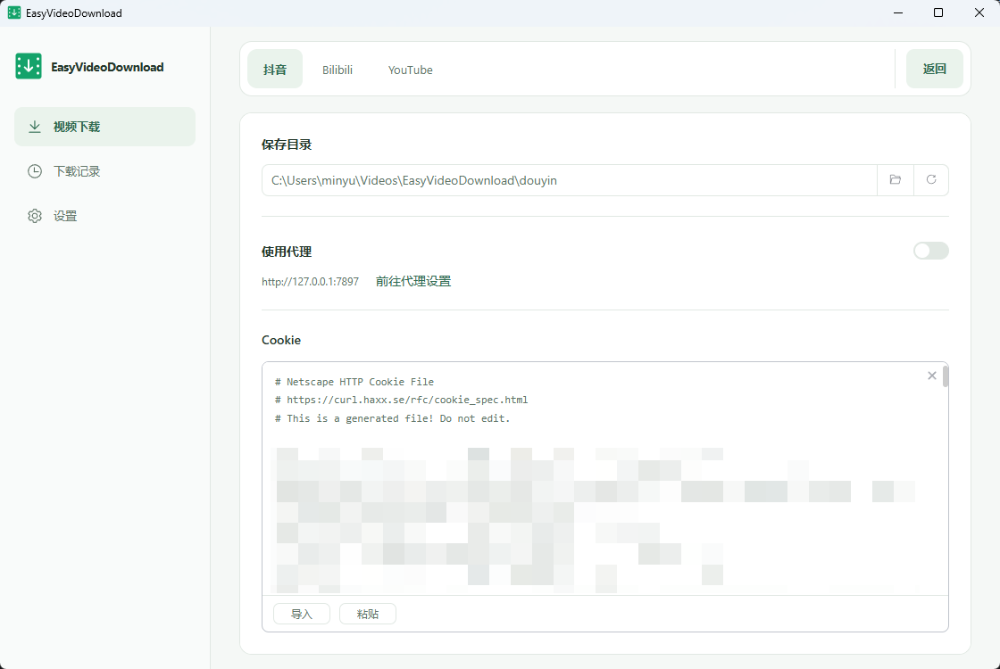
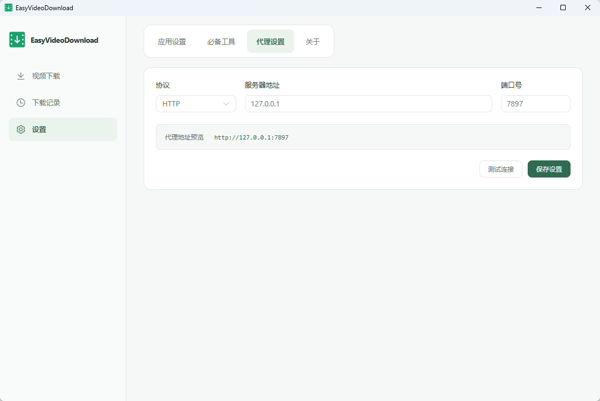
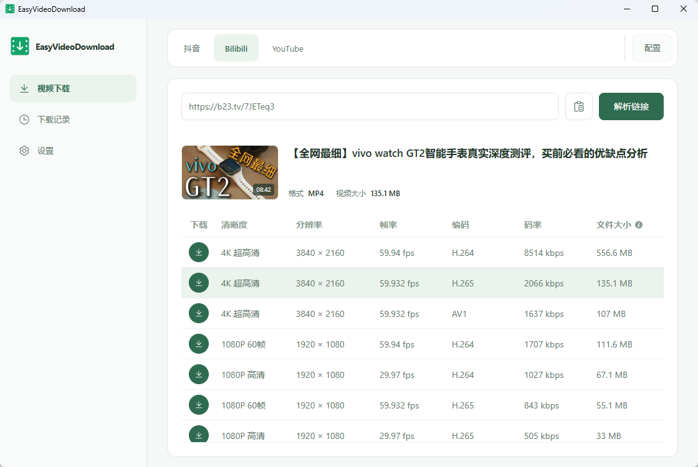
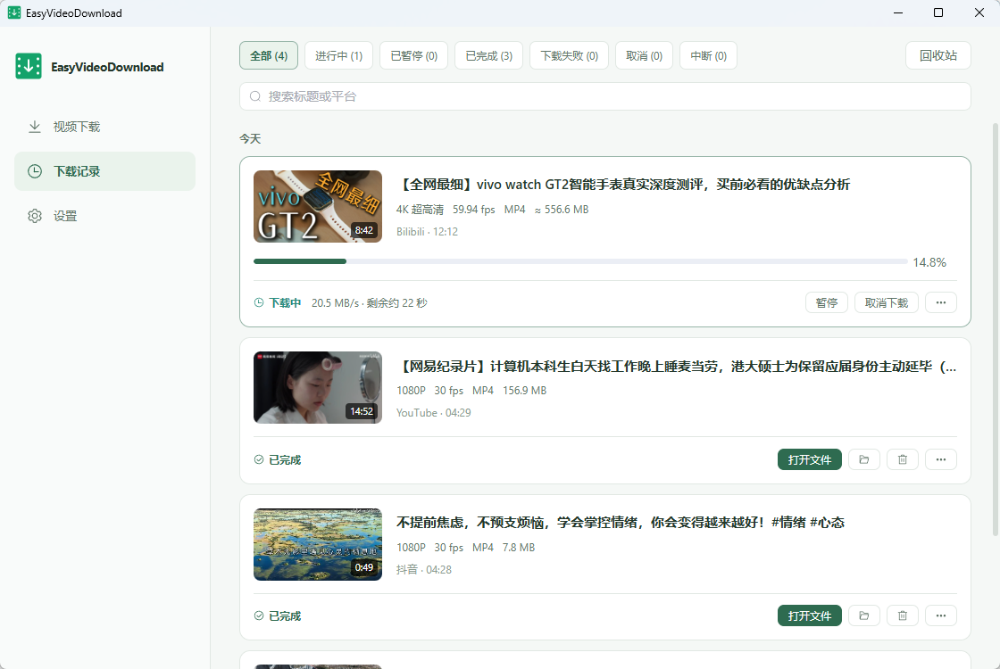

# EasyVideoDownload

一款简单易用、页面美观的桌面视频下载工具。

目前支持的平台：

- [抖音](https://www.douyin.com/)
- [Bilibili](https://www.bilibili.com/)
- [YouTube](https://www.youtube.com/)

## 下载安装

前往 [Releases](https://github.com/MinYu5263/EasyVideoDownload/releases)，下载适合操作系统和架构的安装包。

## 快速开始

### 1. 配置下载工具

进入「设置 → 必备工具」，使用界面提供的自动配置，或手动选择工具路径并检测。

| 平台     | 所需配置                                |
|----------|-----------------------------------------|
| 抖音     | FFmpeg / FFprobe，以及有效的抖音 Cookie |
| Bilibili | yt-dlp、FFmpeg / FFprobe                |
| YouTube  | yt-dlp、FFmpeg / FFprobe，推荐配置 Deno |



### 2. 设置平台

在下载页打开当前平台配置，选择保存目录并导入 Cookie。抖音需要有效 Cookie；Bilibili 和 YouTube 访问登录内容时也需要
Cookie，支持导入文件、粘贴或直接编辑。



### 3. 配置代理

下载 YouTube 等外网视频时，请先在「设置 → 代理设置」配置可用代理并测试连接，再开启对应平台的代理开关。支持 HTTP、HTTPS 和
SOCKS5。



### 4. 视频下载

选择平台，粘贴视频链接或分享文本并解析，查看标题、封面、画质、编码、帧率和大小等信息，点击所需格式开始下载。



### 5. 下载管理

查看任务进度、暂停、继续或取消下载，最大同时下载数可在设置中调整。通过下载记录搜索、筛选和重新下载，也可直接打开视频、所在文件夹或来源链接。



## 开发环境

项目使用 Tauri 2、Vue 3、TypeScript 和 Element Plus。

- **Node.js**：`^20.19.0 || >=22.12.0`。
- **pnpm**：用于安装依赖和执行项目命令。
- **Rust 与 Cargo**：用于编译原生后端。
- **系统构建依赖**：Windows 需要 C++ 构建工具和 WebView2；macOS 需要 Xcode Command Line Tools；Linux 需要 WebKitGTK
  等依赖。详见 [Tauri 环境要求](https://v2.tauri.app/start/prerequisites/)。

## 本地开发与构建

安装依赖、生成图标并启动桌面开发窗口：

```sh
pnpm install --frozen-lockfile
pnpm icons
pnpm tauri dev
```

构建安装包：

```sh
pnpm icons
pnpm tauri build
```

安装包输出到 `src-tauri/target/release/bundle/`。真实解析、下载和文件操作需要在 Tauri 桌面窗口中运行。

## 反馈与贡献

欢迎通过 [Issue](https://github.com/MinYu5263/EasyVideoDownload/issues)
反馈问题和建议，或提交 [Pull Request](https://github.com/MinYu5263/EasyVideoDownload/pulls) 参与改进。

反馈问题时，请提供应用版本、操作系统、复现步骤及错误信息或截图，并移除
Cookie、令牌等隐私信息。开发协作约定见 [AGENTS.md](AGENTS.md)。

## License

当前仓库未包含 LICENSE 文件，暂未声明许可证。
